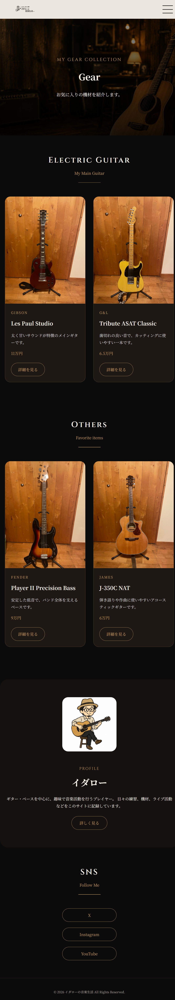
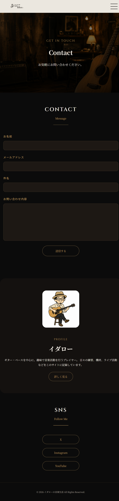

# イダローの音楽生活

## ホームページ

---

## 機材紹介

---

## 活動履歴

---

## お問い合わせ

---
## 概要

「イダローの音楽生活」は、ギター・ベースをテーマにした個人Webサイトです。

機材紹介や活動履歴を掲載し、趣味である音楽の魅力を発信することを目的として制作しました。

レスポンシブデザインに対応し、スマートフォン・タブレット・PCのどの環境でも快適に閲覧できるよう設計しています。

---

## 公開ページ

https://4cdi2205-doo.github.io/guitar-portfolio/
GitHub Pagesで公開しています

---

## 使用技術

- HTML5
- CSS3
- JavaScript (ES6)
- Git
- GitHub
- GitHub Pages

---

## 主な機能

- ホームページ
- ギター・ベース紹介ページ
- 活動履歴ページ
- お問い合わせページ
- レスポンシブ対応
- ハンバーガーメニュー
- JavaScriptによるカードの動的生成

---

## 制作情報

制作期間：2026年6月～7月

制作人数：1人

担当
・デザイン
・HTML/CSS
・JavaScript
・レスポンシブ対応
・GitHub管理

---

## 工夫した点

### デザイン

- 黒・ゴールドを基調とした統一感のある配色
- 音楽サイトらしい落ち着いた雰囲気
- 写真・背景画像を活用した世界観の演出

### 実装

- JavaScriptを利用して機材紹介カードを動的に生成
- CSS Gridを利用したレスポンシブレイアウト
- スマートフォン・PCどちらでも見やすいUI

### GitHub

- Gitを利用したバージョン管理
- GitHub PagesによるWebサイト公開

---

## 今後追加したい機能

- 機材検索機能
- 機材のカテゴリ分け
- ダークモード切替
- 演奏動画の掲載
- お問い合わせ送信機能
- Firebaseとの連携

---

## 学習したこと

この作品を通して

- HTMLによるページ構成
- CSSによるレイアウト設計
- JavaScriptによる動的処理
- Gitによるバージョン管理
- GitHub PagesによるWeb公開

を学びました。

今後はReactやTypeScript、バックエンド技術も学習し、より実践的なWebアプリケーションを開発していきたいと考えています。
